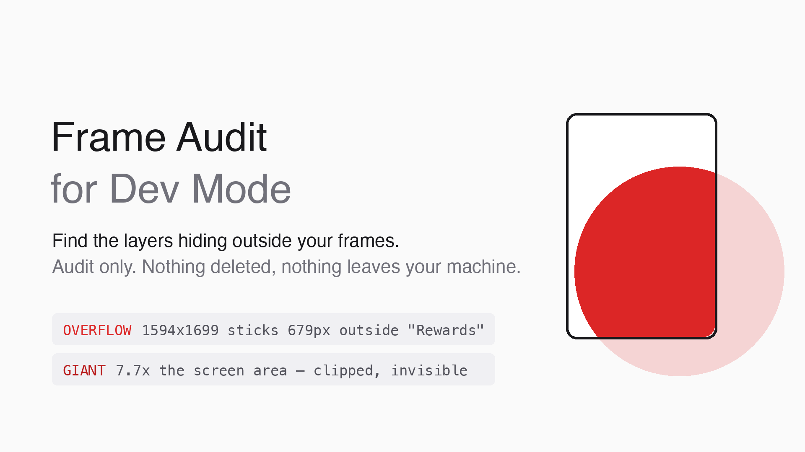

# Frame Audit for Dev Mode



A Figma plugin that finds the layers your designers can't see and your developers
can't ignore.

Runs entirely inside Figma. No account, no API token, no network access —
`networkAccess` is set to `none`, so nothing about your file ever leaves the machine.

## The problem

Dev Mode reads the node tree, not what's visually on the canvas. So a screen that
looks clean can hand developers something very different.

Here is a real 402×874 screen from a production design file:

| Layer | Reality |
|-------|---------|
| `brand_orb_large` | A **1594×1699** image parked at **x = −679, y = −330** — eight times the screen's area, entirely hidden by Clip content |
| `Rectangle 427321742` | 414px wide inside a 402px frame |
| (same orb again) | The identical asset, duplicated |

Nobody looking at that screen in Figma would know. But downstream:

- Measurements are meaningless — the bounding box starts at −679, so every spacing
  value a developer reads is wrong.
- Generated code embeds the full 1594px image.
- Asset exports ship the uncropped original.
- The file gets slower and heavier for everyone.

Figma's built-in tools don't surface this. Outline mode doesn't reveal it, `Cmd+F`
skips it, and deep-select behaves inconsistently around it. Designers usually find
out when a developer asks why a button is 40px off.

## What it detects

| Rule | Meaning | Typical fix |
|------|---------|-------------|
| `OVERFLOW` | Layer sticks more than 1px (any single edge) outside its parent frame. Tagged `clipped` — an ancestor hides it, so it's invisible junk — or `VISIBLE spill` | Crop the layer to the visible part, or move decorations into a properly sized container |
| `GIANT` | Layer bounding box is more than 2× the area of its screen frame. Only the outermost offender is reported, not every wrapper around it | Replace with a cropped export of just the visible region |
| `HIDDEN` | `visible = false` layer | Delete, or move to a scratch page |
| `IMAGE_BLOAT` | Image fill's source resolution is more than 3× its rendered size (compared by area, so extreme crops count too) | Downscale the asset |
| `BASE_SIZE` | Screen-sized top frame (300–500 × 600–1100) that isn't your base device size | Resize to the base, or ignore if intentional |

Findings are grouped by page with a per-rule count. Click any finding to jump to
that layer and select it on canvas.

```
Frame Audit                                    127 findings
OVERFLOW 89   GIANT 12   HIDDEN 21   IMAGE_BLOAT 4   BASE_SIZE 1

▾ Rewards flow                                              14
  OVERFLOW  brand_orb_large
  1594×1699 sticks 679px outside "Rewards" — clipped (invisible junk)

  GIANT     brand_orb_large
  1594×1699 — 7.7x the screen area

▾ Settings                                                   3
  ...

Skipped pages (decorative): Cover, Playground
```

Screens organized inside Figma **Sections** (nested too) are audited the same as
page-level frames. Pages whose name starts with `cover`, `playground`, `archive`,
or `scratch` are skipped — they're decorative by design and would drown the real
findings.

## Audit-only, on purpose

This plugin never deletes or modifies anything. The closest existing tool deletes
out-of-frame layers in one click with no review step, which is exactly the failure
mode worth avoiding: some of those giant decorations are load-bearing, and you want
to look before you cut. Frame Audit shows you the list and jumps you to each layer.
The decision stays yours.

## Install

Not yet on the Figma Community. To run it from source:

1. Open the **Figma desktop app** — Development plugins don't load in the browser.
2. Get the source:
   ```bash
   git clone https://github.com/LOGANLEEE/frame-audit.git
   ```
3. Menu → **Plugins → Development → Import plugin from manifest…** → select
   `manifest.json`. One time only.
4. Run it: **Plugins → Development → Frame Audit for Dev Mode**.

Large files take a few seconds while all pages load.

## Configuration

Everything tunable lives in the constants at the top of `code.js`:

```js
const OVERFLOW_TOLERANCE = 1     // px a single edge may stick out before flagging
const GIANT_AREA_RATIO = 2       // layer area vs screen area
const IMAGE_SCALE_RATIO = 3      // source resolution vs rendered size, per axis
const IMAGE_SIZE_TIMEOUT_MS = 5000
const BASE_W = 402               // base device frame — iPhone 16 Pro by default
const BASE_H = 874
const BASE_TOLERANCE = 2         // px slack on the base-size check
const IGNORED_PAGE_PREFIXES = ['cover', 'playground', 'archive', 'scratch']
```

No build step. Edit `code.js`, re-run the plugin in Figma — no need to re-import.

## Extending it with Claude Code

The repo ships a `CLAUDE.md` written for designers, not engineers. Open this folder
in [Claude Code](https://claude.com/claude-code) and it will explain the plugin,
walk you through installing it, and make changes on request — while enforcing the
project's rules (stay offline, stay audit-only, run the tests after every edit).

Things it handles well:

> "Ignore our Icons page too."
>
> "Too many overflow warnings — only flag things sticking out more than 10px."
>
> "Add a rule that flags text layers using a font other than Inter."

## Development

```bash
node test.cjs
```

`test.cjs` runs the plugin against a mocked `figma` global and a synthetic document
— no Figma installation needed. It covers every rule, the Section-flattening path,
the GIANT de-duplication, ignored pages, and the failure path where loading pages
throws. 18 assertions; all must print `ok`.

## Design notes

A few decisions that aren't obvious from the code:

**Geometry comes from `absoluteBoundingBox`, never `absoluteRenderBounds`.**
Render bounds include drop shadows and blur, which would flag every shadowed card
as overflowing, and they are pre-clipped by `clipsContent` ancestors — which would
hide precisely the junk this plugin exists to find.

**`GIANT` reports only the outermost offender.** A 2000px decoration wrapped in
three groups is one problem, not four.

**`OVERFLOW` measures the largest single edge**, not the sum of all four. Summing
lets four sub-threshold edges add up to a false positive.

**Instances are checked as a whole box.** Their internals mirror the main component,
which gets audited wherever it actually lives. Overrides inside instances are a
known blind spot.

**Rotated layers are measured by their axis-aligned bounding box**, since Figma
exposes no rotated-bounds API. A rotated decoration near an edge may flag slightly
early.

## Prior art

[Auto Cleanup: Delete Hidden Layers](https://www.figma.com/community/plugin/1488555444196895302)
advertises an "outside frame layers" filter, but deletes in one click with no review
step and has no oversized-image or base-size checks. Style linters
([Design Lint](https://github.com/destefanis/design-lint) and similar) check colors,
fonts, and tokens — not geometry. Nothing found checks a child's bounds against its
parent frame, which is what this does.

## Support

Found a false positive, a structure it misses, or want a rule added? Open an issue:
<https://github.com/LOGANLEEE/frame-audit/issues>

## License

MIT
